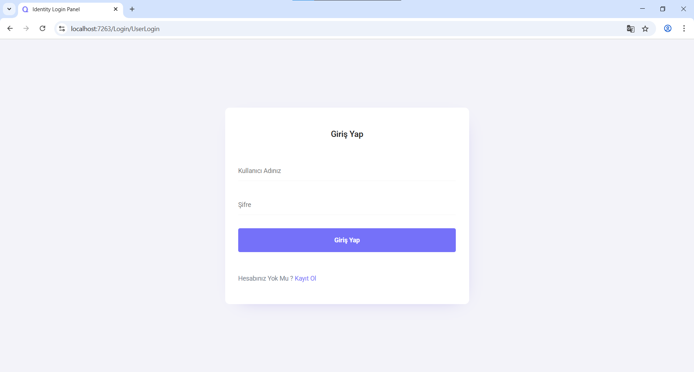
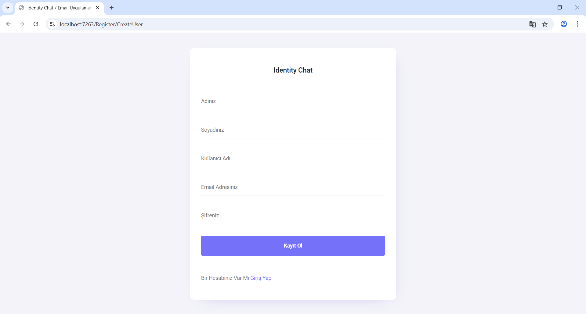

# 📧 Email Projesi

Bu proje, **.NET Core** ile geliştirilmiş tam işlevsel bir **e-posta yönetim sistemidir**.  
Kullanıcılar kayıt olabilir, giriş yapabilir, e-posta gönderebilir.
Proje, **Entity Framework Core** ve **ASP.NET Identity** altyapısı ile desteklenmektedir.

---

## 🔑 Özellikler

- ✅ **Kullanıcı Kaydı ve Girişi (Register/Login)**
- 🔐 **Şifrelerin Hash'lenmiş şekilde veritabanında saklanması**
- 👤 **Profil sayfasında kullanıcı bilgileri:**
  - Ad
  - Soyad
  - E-posta adresi
  - Kullanıcı adı
- 📊 **Kullanıcının gönderdiği ve aldığı toplam e-posta sayılarının görüntülenmesi**
- ✏️ **Profil bilgilerini güncelleme**
- 📨 **Yeni mesaj gönderme**
- 📥 **Gelen Kutusu (Inbox)**
- 📤 **Gönderilenler Klasörü (Sent)**
- 🔎 **Konuya göre arama (Contains filtreleme)**
- 📌 **Sidebar'da dinamik mesaj sayıları**
- ⚙️ **EF Core ile veri yönetimi (AppDbContext ve Migrations)**

---

## 🛠️ Kullanılan Teknolojiler

- **ASP.NET Core MVC**
- **Entity Framework Core**
- **ASP.NET Identity**
- **MS SQL Server**
- **Bootstrap 4**
- **LINQ**
- **Razor Views**

---

## 💾 Veritabanı Yapısı

### 📬 EmailMessages Tablosu

E-posta verileri `Messages` tablosunda saklanmaktadır:

- `SenderEmail`
- `ReceiverEmail`
- `Subject`
- `MessageDetail`

### 👥 AspNetUsers Tablosu

Kullanıcı bilgileri `AspNetUsers` tablosunda tutulur.  
Şifreler, **ASP.NET Identity** ile hash’lenerek saklanır.

---

## 📌 Ek Notlar

- Giriş yapmış kullanıcının bilgileri `User.Identity.Name` üzerinden alınır.
- E-posta gönderirken `SenderEmail`, giriş yapan kullanıcıdan otomatik olarak çekilir.
- `ViewBag` üzerinden gelen ve giden mesaj sayıları **dinamik** olarak gösterilir.

## 📷 Ekran Görüntüleri

### 1. Giriş Sayfası

### 2. Kayıt Sayfası

### 3. Profil Sayfası

### 4. Gelen Kutusu

### 5. Giden Kutusu

### 6. Arama Sayfası

### 7. Mesaj Detayları

### 8. Mesaj Gönderme

